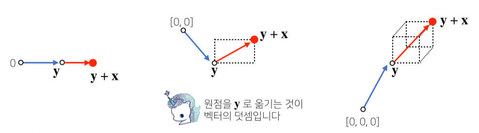
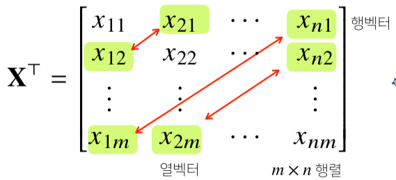
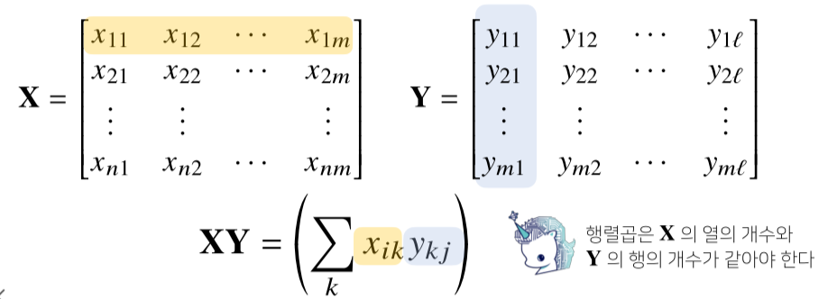
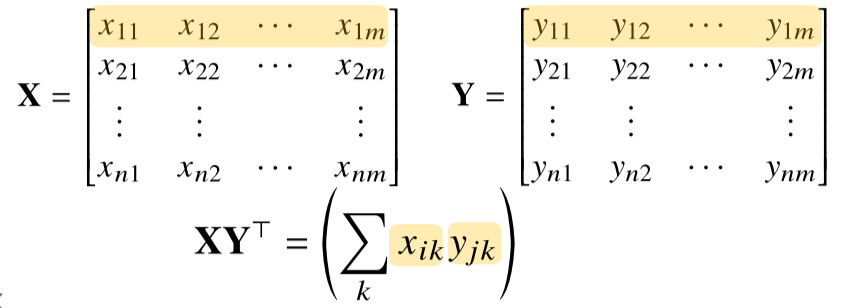
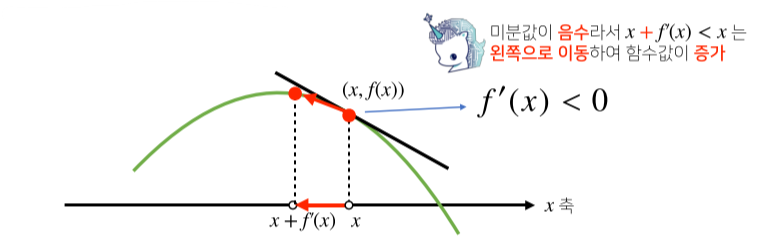
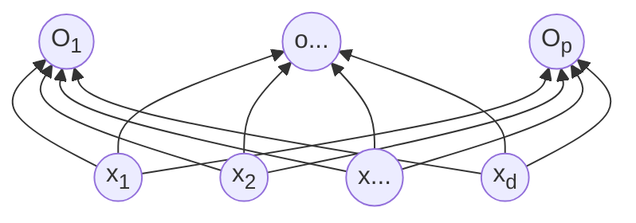
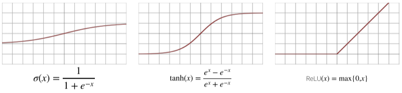
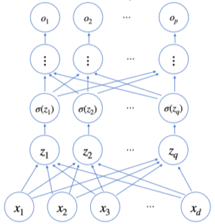
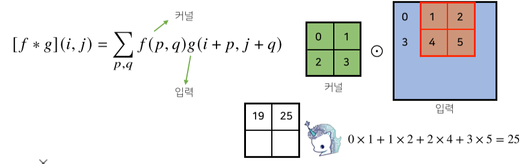

[TOC]

# AIMath

## Vector

### 벡터란?

- **숫자를 원소로 가지는 리스트 또는 배열**을 의미

  > 벡터의 코딩상 의미

  

- X = 열 벡터, X^T^ = 행 벡터

- 수학적으로는 **공간에서의 한 점, 원점으로 부터의 상대적 위치**를 의미

  > 벡터의 수학적 의미


- 각 벡터가 가지는 행과 열의 수를 **벡터의 차원**이라고 한다.

### 벡터의 성질

**1. 벡터에 양수를 곱해주면 방향은 그대로, 길이만 변한다.**

   - 이 때 곱해주는 숫자를 **스칼라곱(α)**이라고 표현한다.

   - 스칼라곱이 음수이면 방향이 정반대 방향이 된다.

   - 벡터의 길이는 1보다 크면 길이가 증가, 1보다 작으면 길이가 감소한다.
**2. 같은 모양(같은 행과 열)을 가지면 덧셈, 뺄셈, 곱셈, 나눗셈이 가능하다.**
	- 이때의 곱셈을 성분곱(Hadamard product)라고 한다.
	- numpy array에도 적용된다.
**3. 벡터와 벡터의 덧셈과 뺄셈은 다른 벡터로부터 상대적 위치 이동을 표현함.**



### 벡터 노름(norm)과 기하학적 성질

#### 벡터의 노름

- **벡터의 노름(norm)은 원점에서부터의 거리를 의미**

  - 차원의 수와 관계없이 모든 벡터는 노름을 구할 수 있다.
  - **L~1~-노름은 각 성분의 변화량의 절대값의 합**을 의미
    - (x,y)는 |x|+|y| 만큼 거리
  - **L~2~-노름은 피타고라스 정리를 이용해 유클리드 거리**를 계산
    - (x,y)는 sqrt(|x|^2^ +|y|^2^)를 의미
    - `np.linalg.norm`으로 구현 가능
  - ||．|| 기호는 노름이라고 부름

  $$
  \left\| x\right\|_1 = \sum_{i=1}^d|x_i|\\
  \left\| x\right\|_2 = \sqrt{\sum_{i=1}^d|x_i|^2}\\
  $$

> 백터 노름의 코드 구현

```python
def l1_norm(x):
    x_norm = np.abs(x)
    x_norm = np.sum(x_norm)
    return x_norm

def l2_norm(x):
    x_norm = x*x
    x_norm = np.sum(x_norm)
    x_norm = np.sqrt(x_norm)
    return x_norm
```

#### 노름의 활용과 성질

- 노름의 종류를 무엇으로 적용하느냐에 따라 기하학적 성질이 달라진다.

  - L~1~노름은 마름모 모양의 원을 그리며, L~2~노름은 기존의 원 모양의 원을 가진다.
  - 노름의 종류에 따라 머신러닝에서의 활용도 달라진다.

- 노름을 이용해 **두 벡터 사이의 거리를 뺄셈을 통하여 계산**할 수 있다.

  

  - ||y - x|| = || x - y|| 인점을 이용하게 된다.
  - 즉 x-y 또는 y-x를 한 원점에서의 좌표를 이용해 L2 norm을 구하면 두벡터 사이의 거리가 나온다.

- **L~2~노름 한정으로 내적을 이용해 이렇게 구한 벡터사이의 거리를 이용해 각도 또한 계산** 가능하다.

  

  - **<x, y> 는 내적(inner product)을 의미하며 성분 곱들의 합을 의미한다.**
    - 예를 들어 x = (0, 1), y = (0, 2)의 내적은  0 * 0 + 1 * 2 = 2 이다.

> 내적을 이용한 각도 계산

```python
def angle(x,y):
    # np.inner(x, y)가 내적을 구하는 numpy 함수
    v = np.inner(x, y) / (l2_norm(x) * l2_norm(y))
    theta = np.arccos(v)
    return theta
```

#### 내적의 해석

- 내적은 **정사영(orthogonal projection)된 벡터의 길이**와 관련 있다.

  - Proj(x)는 벡터 y로 정사영된 벡터 x의 그림자를 의미한다.
  - Proj(x)의 길이는 코사인법칙에 의해

  $$
  \left\|x\right\|cos\theta
  $$

  - 가 된다.

    

  - 이때 **내적은 정사영의 길이를 벡터 y의 길이 ||y||만큼 조정한(곱한) 값**이다.

  - 내적을 이용해 유사도(similarity)를 구할 수 있다.

## Matrix

### 행렬이란?

- **벡터를 원소로 가지는 2차원 배열**

> 행렬의 수식 표현

$$
X = \begin{bmatrix} 1 & -2 & 3 \\ 7 & 5 & 0 \\ -2 & -1 & 2\end{bmatrix}
$$

> 행렬의 코드 표현

```python
x = np.array([[1, -2, 3], [7, 5, 0], [-2, -1, 2]]) # numpy에선 행(row)이 기본단위
```

$$
\boldsymbol{X} = \begin{bmatrix} \boldsymbol{x_{1}} \\ \boldsymbol{x_{2}} \\ \boldsymbol{\vdots}\\ \boldsymbol{x_{n}} \end{bmatrix} = \begin{bmatrix} x_{11} & x_{12} & \dots & x_{1m}\\ x_{21} & x_{22} & \dots & y_{2m}\\ \vdots & \vdots & & \vdots\\ x_{n1} & x_{n2} & \dots & x_{nm}\end{bmatrix}
\begin{aligned}\boldsymbol{x_{1}}\\ \boldsymbol{x_{2}}\\ \boldsymbol{x_{7}}\end{aligned}
$$

- n x m 행렬의 표현

- 행렬은 **행(row)과 열(column)이라는 인덱스(index)**를 가집니다.

- 행렬의 특정 행이나 열을 고정하면 행 벡터 또는 열 벡터라 부른다.

-  전치 행렬(transpose matrix) **X^T^**는 행과 열의 인덱스가 바뀐 행렬을 의미함.

  - 벡터 또한 동일하게 행과 열이 바뀐 전치 벡터가 존재한다.

  

### 행렬의 이해

**1. 첫번째 의미**

- 벡터가 공간의 한점을 의미한다면 행렬은 **공간에서 여러 점들의 집합**을 의미함.
- 행렬의 행벡터 x~i~는 i번째 데이터를 의미함.
- 행렬 x~ij~는 i번째 데이터의 j 번재 변수값을 의미함.


- 벡터와 마찬가지로 **같은 모양을 가지면 같은 인덱스 위치끼리 덧셈, 뺄셈. 성분곱을 계산할 수 있다.**
-  벡터와 마찬가지로 **스칼라곱(α) 또한 가능하다.**

**2. 두번째 의미**

- 행렬은 **벡터 공간에서 사용되는 연산자(operator)**를 의미.
- 행렬 곱을 통해 벡터를 다른 차원의 공간을 보낼 수 있음
  - 행렬을 X벡터와 곱하면 m차원에서 n차원 벡터로 변환되어 n차원의 z벡터가 됨.
  - 이를 통해 맵핑, 디코딩 등이 가능함.
  - 이를 **선형 변환(linear transform)**이라고도 함.
  - 딥러닝은 선형 변환과 비선형 변환의 합성으로 이루어짐
- 패턴 추출, 데이터 압축 등에도 사용함.


### 행렬의 곱셈(matrix multiplication)과 내적

**1. 행렬의 곱셈(matrix multiplication)**

- 행렬 곱셈은 **i번째 행벡터와 j 번째 열벡터 사이의 내적을 성분으로 가지는 행렬**을 만듭니다.



- 고로 행과 열의 갯수가 같아야 가능하다.

> 행렬의 곱셈 code 구현 시

```python
X = np.array([[1, -2, 3],
            	[7, 5, 0],
            	[-2, -1, 3]])
Y = np.array([[0, 1],
            	[1, -1],
            	[-2, 1]])
print(x @ Y) # numpy에선 @ 연산으로 행렬 곱셈 계산
# array([[-8, 6],
#        	[5, 2],
#         	[-5, 1]])
```

**2. 행렬의 내적**

- `np.inner`는 **i번째 행벡터와 j번째 행벡터 사이의 내적을 성분으로 가지는 행렬**을 계산합니다.
- 수학의 행렬 내적 **tr(XY^T^)**과 다름


> 행렬의 내적 code 구현 시

```python
X = np.array([[1, -2, 3],
            	[7, 5, 0],
            	[-2, -1, 3]])
Y = np.array([[0, 1, -1],
            	[1, -1, 0]])
print(np.inner(x, Y)) # numpy에선 np.inner() 함수로 행렬 내적 계산
# array([[-5, 3],
#        	[5, 2],
#         	[-3, -1]])
```

### 역행렬의 이해

- **행렬 A의 연산을 같은 연산으로 거꾸로 돌리는 행렬을 역행렬(Inverse matrix)라고 부르며, A^-1^라 표기**한다.
- **행과 열 숫자가 같고 행렬식(determinant)가 0이 아닌 경우에만 계산 가능**.

> 역행렬과의 행렬곱의 결과

$$
AA^{-1} = A^{-1}A = I(항등행렬)
$$

- **항등행렬(Identity Matrix)은 곱하게 될 시 자기 자신이 나오는 행렬이다.**

> 역 행렬의 코드 구현

```python
Y = np.array([[1, -2, 3], [7, 5, 0], [-2,-1,2]])
print(Y @ np.linalg.inv(Y)) # np.linalg.inv(Y) Y 행렬의 역행렬이 리턴
# array([[1, 0, 0], [0, 1, 0], [0, 0, 1]]) # 정확히는 float으로 비슷한 값이 나온다.
```

- 역행렬을 계산할 수 없는 조건이라면 유사역행렬(pseudo-inverse) 또는 무어-펜로즈(Moore-Penrose) 역행렬 A^+^을 이용한다.

> 유사역행렬의 성질

$$
n \geq m 인\ 경우, \  A^+ = (A^TA)^{-1}A^T,\ A^+A = I\\  
n \leq m 인\ 경우, \  A^+ = A^T(A^TA)^{-1},\ AA^+ = I\\
$$

- 순서를 바꾸면 결과가 달라지므로 유사역행렬의 순서에 주의!

> 유사 역행렬의 코드 구현

```python
Y = np.aray([[0, 1], [1,-1], [-2,1]])
print(Y @ np.linalg.pinv(Y)) # np.linalg.pinv(Y) Y 행렬의 유사역행렬이 리턴
# array([[1, 0], [0, 1]]) # 정확히는 float으로 비슷한 값이 나온다.
```

### 행렬의 응용

**1. 연립방정식 풀기**

$$
a_{11}x_1 + a_{12}x_2 + \dots + a_{1m}x_{m} = b_{1}\\
a_{12}x_1 + a_{22}x_2 + \dots + a_{2m}x_{m} = b_{2}\\
\vdots\\
a_{n1}x_1 + a_{n2}x_2 + \dots + a_{nm}x_{m} = b_{n}\\

n \leq m \ 인\ 경우:\ 식이\ 변수\ 개수보다\ 작거나\ 같아야\ 함
$$

_**sol)**_  n이 m보다 작거나 같으면 무어-펜로즈 역행렬을 이용해 해를 하나 구할 수 있다.
$$
Ax = B \\
\Rightarrow x = A^+b\\
=A^T(AA^T)^{-1}b
$$

**2. 선형회귀분석**

- `np.linalg.pinv`를 이용하면 데이터를 선형모델(linear model)로 해석하는 선형회귀식을 찾을 수 있다.

- `sklearn`의 `LinearRegression`과 같은 결과를 가져옴

```python
# Scikit Learn을 활용한 회귀분석
from sklearn.linear_model import LinearRegression
model = LinearRegression()
model.fit(x,y)
y_test = model.predict(x_test)

# Moore-Penrose 역행렬, y절편(intercept)항을 직접 추가해야한다.
X_ = np.array([np.append(x,[1]) for x in X]) # intercept 항 추가
beta = np.linalog.pinv(X_) @ y
y_test = np.append(x, [1]) @ beta
```

## Gradient Algorithm(경사하강법)

### 미분 (differentiation)이란?

- **변수의 움직임에 따른 함수값의 변화를 측정하기 위한 도구.**
- **변화율의 극한, 최적화에서 제일 많이 사용하는 기법.**

$$
f'(x) = \lim_{h\rightarrow0}\frac{f(x+h) - f(x)}h
$$

> 미분 코드 구현

```python
import sympy as sym # 기호를 통해 함수를 이해하게 해줌
from sympy.abc import x

sym.diff(sym.poly(x**2 + 2*x + 3), x)
#Poly(2*x + 2, x, domain='zz')
```
### 미분 활용
- 함수 그래프의 접선의 기울기와도 같으며, 이를 통해 함수값의 증감을 알 수 있다.


- 이렇게 구한 기울기를 통하여 미분값을 더하거나 빼서, 고차원 공간에서도 최적화 가능

  - 
  - 미분값을 더하면 경사상승법이라 하며, 함수의 극대값을 찾는데 사용
  - 미분값을 빼면 경사하강법이라 하며, 함수의 극소값을 찾는데 사용
- 극소값이나 극대값에 도달하면 미분값이 0이므로 최적화가 종료됨.
  
    


### 경사하강법 (Gradient Algorithm) 구현
> 코드 구현 슈도 코드

```python
Input : gradeint, init, lr, eps, Output: var
# gradient: 미분을 계산하는 함수
# init: 시작점, lr: 학습률, eps: 알고리즘 종료 조건

var = init
grad = gradient(var)
while(abs(grad) > eps): # 미분값이 정확이 0이 되는 경우는 거의 없음, 즉 아주 작은값(eps)이하가 되면 종료
    var = var - lr * grad # lr: 학습률이 높을수록 넓게 업데이트함, 너무 크거나 작으면 안됨
    grad = gradient(var) # 미분값 업데이트
```

**다변수 함수일 경우?**

- 벡터가 입력인 다변수 함수의 경우 **편미분(partial differentiation)**을 사용.

$$
\partial _{x_{i}}f\left( x\right) =\lim _{h\rightarrow 0}\dfrac{f\left( x+he_{i}\right) -f\left( x\right) }{h}\\
e_{i}\ :\ i번째\ 값만 \ 1이고\ 나머지는\ 0인\ 단위벡터
$$

> 코딩을 이용한 편미분

```python
import sympy as sym
from sympy.abc import x, y

sym.diff(sym.poly(x**2 + 2*x*y + 3) + sym.cos(x + 2*y), x)
# 2*x + 2*y - sin(x+2*y)
```

- 각 변수 별로 **편미분을 계산한 그레이언트 벡터를 이용하여 경사하강/경사상승법**에 사용 가능.

$$
\partial _{x_{i}}f\left( x\right) =\lim _{h\rightarrow 0}\dfrac{f\left( x+he_{i}\right) -f\left( x\right) }{h}\\
e_{i}\ :\ i번째\ 값만 \ 1이고\ 나머지는\ 0인\ 단위벡터 \\ 
\nabla f = (\partial_{x1}f,\partial_{x2}f,\dots,\partial_{xd}f)
$$

### 그레디언트 벡터 (Gradient vector) 이용한 경사하강법


- ∇f (x,y)는 임의의 점(x,y)에서 가장 빨리 함수값이 증가하는 방향이다
- 그러므로  -∇f (x,y)방향으로 가면 가장 빨리 함수값이 감소하는 방향이 되며, 이를 적용해 경사하강을 한다.

> 그레디언트 벡터가 적용된 경사하강법 슈도코드

```python
Input : gradeint, init, lr, eps, Output: var
# gradient: 그레디언트 벡터를 계산하는 함수
# init: 시작점, lr: 학습률, eps: 알고리즘 종료 조건

var = init
grad = gradient(var)
while(norm(grad) > eps): # 벡터의 절대값 대신 노름(norm)을 계산해 종료조건 설정
    var = var - lr * grad # lr: 학습률이 높을수록 넓게 업데이트함, 너무 크거나 작으면 안됨
    grad = gradient(var) # 미분값 업데이트
```

### 경사하강법의 선형 회귀 적용 (apply to linear regression)

- 무어-펜로즈 행렬을 이용해서 선형회귀가 가능했지만, 경사하강법을 이용하는게 일반적이다.

- **선형회귀의 목적식은 ∥y-Xβ∥~2~ 또는 ∥y-Xβ∥~2~^2^ ** 이며, 이를 최소하하는 β를 찾는게 목적이므로 다음과 같은 그레디언트 벡터를 구해야한다.(loss : RMSE 기준)
  $$
  \nabla_\beta\left\| y - X\beta\right\|_2  = (\partial_{\beta_1}\left\| y - X\beta\right\|_2,\dots,\partial_{\beta_d}\left\| y - X\beta\right\|_2)\\
  \partial_{\beta_k}\left\| y - X\beta\right\|_2 = \partial_{\beta_k}\left\{\frac{1}n\sum_{i=1}^n{\left(y_i - \sum_{j=1}^{d}X_{ij}\beta_j\right)^2}\right\}^\frac{1}2 = -\frac{X^T_{\cdot k}(y - X\beta)}{n\left\| y - X\beta\right\|_2}\\
  X^T_{\cdot k} = 행렬\ X의\ k번째\ 열(column)\ 벡터를\ 전치시킨\ 것\\
  즉,\\
  \nabla_\beta\left\| y - X\beta\right\|_2  = (\partial_{\beta_1}\left\| y - X\beta\right\|_2,\dots,\partial_{\beta_d}\left\| y - X\beta\right\|_2) = \left( -\frac{X^T_{\cdot 1}(y - X\beta)}{n\left\| y - X\beta\right\|_2},\dots, -\frac{X^T_{\cdot d}(y - X\beta)}{n\left\| y - X\beta\right\|_2}\right)
  $$

- 이에 목적식을 최소화하는 β를 구하는 경사하강법 알고리즘은 다음과 같다.

$$
\beta^{(t+1)}\leftarrow\beta^{(t)} - \lambda\nabla_\beta\left\| y - X\beta\right\|_2 =\beta^{(t)} + \frac{\lambda}n\frac{X^T(y - X\beta^{(t)})}{\left\| y - X\beta\right\|_2}\\
$$

- 목적식으로 ∥y-Xβ∥~2~ 대신 ∥y-Xβ∥~2~^2^을 최소화하면 식이 좀더 간단해진다.

$$
\nabla_\beta\left\| y - X\beta\right\|_{2}^2  = (\partial_{\beta_1}\left\| y - X\beta\right\|_{2}^2,\dots,\partial_{\beta_d}\left\| y - X\beta\right\|_{2}^2) = -\frac{2}nX^T(y - X\beta) \\
\beta^{(t+1)}\leftarrow\beta^{(t)} + \frac{2\lambda}{n}X^T(y - X\beta^{(t)})
$$

> 경사하강법 기반 선형회귀 알고리즘 슈도 코드

```python
Input: X, y, lr, T, Output: beta
# norm: L2-노름을 계산하는 함수
# lr: 학습률, T: 학습횟수 = hyperparameter
for t in range(T):  # 학습횟수 제한, 또는 이전 처럼 일정한 수준 이하로 떨어질 때까지 해도 된다.
    error = y - X @ beta
    grad = - transpose(X) @ error
    beta = beta - lr * grad # 베타 업그레이드
```

### 확률적 경사하강법 (stochastic gradient descent)

- 이론적으로 적절한 학습률과 학습횟수를 선택시, 수렴이 보장되어있다.

- 하지만 비선형회귀의 경우 목적식이 볼록하지 않으므로(non-convex) 수렴이 항상 보장되지 않음

  - 딥러닝의 목적식은 대부분 볼록함수가 아니다, 즉 대부분 보장하지 않음
  - 아래와 같은 경우 특정 부분에 수렴했지만 함수의 최소지점이 아니다.

  

​	

- **확률적 경사하강법(SGD)은 모든 데이터를 사용해서 업데이트 하는 대신 데이터 한개 또는 일부활용하여 업데이트**합니다.

  > 가정

  

  

$$
\theta^{(t+1)}\leftarrow\theta^{(t)}-\widehat{\nabla _{a}L}(\theta^{(t)})
$$

- 만능은 아니지만 딥러닝에서 **mini-batch 방식을 추가**하여 일반적으로 사용함.
- SGD는 데이터의 일부를 가지고 패러미터를 업데이트하기 때문에 연산자원을 좀 더 효율적으로 활용
  - **연산량이 b/n으로 감소**

$$
\beta^{(t+1)}\leftarrow\beta^{(t)} + \frac{2\lambda}{b}X^T_{(B)}(y_{(b)} - X_{(b)}\beta^{(t)})
$$

- 경사하강법은 전체 데이터를 가지고 목적식 그레디언트 벡터를 계산하는 반면, SGD는 미치배치(데이터의 일부)를 가지고 그레디언트 벡터를 계산

- 그러므로 매번 다른 데이터셋을 사용하는 것과 비슷하기 때문에 함수 곡선의 모양이 미니배치마다 바뀌게 된다.

- 하지만 최종적인 방향성은 유사하게 이동하게 된다.

  

- 즉 볼록모양이 아니어도 효율적으로 활용가능 하다.

> 경사하강법(좌) vs 확률적 경사하강법(우)


- 다만 mini-batch 사이즈를 너무 작게 잡으면 경사하강법에 비해 너무 느려진다.

- 최근에는 경사하강법으로 전체 데이터를 이용해 학습시키면, 방대한 데이터셋에 의하여 메모리가 초과되므로 미니배치로 나누어서 학습하는 SGD를 사용한다.

## 인공지능 학습의 수학적 이해

### 신경망의 해석

- 비선형, 복잡한 모델이 대부분인 신경망은 사실 선형 모델과 비선형 함수들의 결합으로 이루어져 있다.

$$
\begin{aligned}\begin{aligned}\begin{bmatrix} O_1 \\ O_2 \\ \vdots \\ O_n \end{bmatrix} = \begin{bmatrix} x_1 \\ x_2 \\ \vdots \\ x_n \end{bmatrix} \begin{bmatrix} w_{11} & w_{12} & \dots & w_{1p}\\  w_{21} & w_{22} & \dots & w_{2p} \\ \vdots & \vdots & \ddots & \vdots \\ w_{d1} & w_{d2} & \dots & w_{dp} \end{bmatrix} + \begin{bmatrix} \vdots&\vdots&\ddots&\vdots\\b_1&b_2&\dots&b_p \\ b_1&b_2&\dots&b_p \\ b_1&b_2&\dots&b_p\\\vdots&\vdots&\ddots&\vdots\end{bmatrix}\\
O\ \ \ \ \ \ \ \ \ \ \ \ \ \ X\ \ \ \ \ \ \ \ \ \ \  \ \ \ \ \ \ \ \ \ \ \ \ W \ \ \ \ \ \ \ \ \ \ \ \ \  \ \ \ \ \ \ \ \ \ \ \ \ \ \ \ \ \ \ \ \ \ \ \ \ \ \ \ \ \ \ \ b\ \ \ \ \ \ \ \ \ \ \ \ \ \ \end{aligned}\\(n \times p)\ \ \ \ (n \times d)\ \ \ \ \ \ \ \ \ \ \ \ \ \ \ (d\times p)\ \ \ \ \ \ \ \ \ \ \ \ \ \ \ \ \ \ \ \ \ \ \ \ \ \ \ \ \ \ \ \ \ \ \ (n\times p) \ \ \ \ \ \ \ \ \ \end{aligned}
$$

**[math 0. 신경망 수식 분해]**

- b는 각 한 행의 모든 값이 같다.



**[chart 0. 신경망 모델의 차트화]**

- d개의 변수로 p개의 선형모델을 만들어 p개의 잠재변수를 설명하는 모델의 도식화이다.

- 화살표는 w~ij~들의 곱을 의미한다.

### 소프트맥스 연산

$$
softmax(o) = softmax(Wx+b) = 
\left( \dfrac{\exp(0)}{\sum_{k=1}^p\exp(o_k) }, \dots, \dfrac{\exp(0_p)}{\sum_{k=1}^p\exp(o_k) },\right)
$$

**[math1.softmax]**

- 소프트맥스(softmax) 함수는 *모델의 출력을 확률로 해석할 수 있게 변환해주는 연산*
- 분류 문제를 풀 때 선형모델과 소프트 맥스 함수를 결합하여 예측

```python
def softmax(vec):
    denumerator = np.exp(vec - np.max(vec, axis=-1, keepdims=True)) # 각 출력의 값
    # 너무 큰 벡터가 들어오는 것을 막기위해 np.max(vec)을 vec에서 빼서 방지
    numerator = np.sum(denumerator, axis=-1, keepdims=True)#모든 출력의 값들의 합
    val = denumerator / numerator
    return val
```

**[code 1.softmax의 코드 구현]**

- 이러한 소프트맥스 함수로 벡터를 확률 벡터(각 성분의 합이 1인 벡터)로 변환할 수 있다.

```python
def one_hot(val, dim):
    return [np.eye(dim)[_] for _ in val]
def one_hot_encoding(vec):
    vec_dim = vec.shape[1]
    vec_argmax= np.argmax(vec, axis=-1)
    return one_hot(vec_argmax, vec_dim)
```

**[code 1-1.one_hot 함수 구현]**

- 학습이 아닌 추론시에는 one_hot 벡터를 이용해 가장 큰 벡터를 정답으로 삼으면 되므로 softmax()를 씌울 필요 없다.(~~one_hot(softmax(o)~~=> **X**, one_hot(o) => **O**)

### 활성화 함수(activation function)와 다층 신경망(MLP)

- 신경망은 *선형모델과 활성함수(activation function)을 합성한 함수*

$$
\bold{H} = (\sigma (z_1), \dots, \sigma(z_n)), \sigma(z) = \sigma(Wx + b)\\
\sigma = 활성함수(비선형),\ z = (z_1,\dots,z_q) = 잠재벡터,\ \bold H = 새로운\ 잠재벡터 = 뉴런
$$

**[math 2. 신경망 뉴런]**


**[img 2. 신경망 뉴런 도식화]**

- *잠재벡터들을 이용해 만든 새로운 잠재벡터들*,(그리고, 이 새로 만든 잠재벡터로 만들 새로운 잠재벡터들)을 *뉴런(neuron) 또는* 이라고 하며, 이러한 구조의 인공신경망을 *퍼셉트론(perceptron)*이라고 한다.
  - 각 뉴런(노드) 가 가지고 있는 값은 텐서(tensor)라고 한다.

- 활성화 함수는 *실수값을 받아 실수값을 돌려주는 비선형(nonlinear) 함수*
  - 비선현 근사를 하기 위해 존재
- 이로 인해 딥러닝이 선형모형과 차이를 보였으며, *시그모이드(sigmoid), tanh, 그리고 주로 쓰이고 있는 ReLU 함수* 등이 있다. 



**[img 3. sigmoid, tanh, ReLu 함수 그래프]**

- 만약, 이렇게 구한 *잠재 벡터 H에서 가중치행렬 W^(2)^와 b^(2)^를 통해 다시 한번 선형 변환해서 출력하게 되면 (W^(2)^, W^(1)^)를 패러미터로 가진 2층(2-layers) 신경망*이 된다.

$$
\bold O = \bold H\bold W^{(2)} + b^{(2)},\  \bold{H} = (\sigma (z_1), \dots, \sigma(z_n)) = \sigma(\bold Z^{(1)}),\ \sigma(z) = \sigma(W^{(1)}x + b^{(1)}) \\
\bold Z^{(1)} = \bold X\bold W^{(1)} + \bold b^{(1)}
$$

**[math 2-1. 2중 신경망]**


**[img 2-1.2중 신경망의 구조]**

- 이렇게 *신경망이 여러층 합성된 함수를 다층(multi-layer) 퍼셉트론(MLP)*라고 한다.

$$
\\ \bold O = \bold Z^{(L)}
\\ \vdots
\\ \bold H^{(l)} = \sigma(\bold Z^{(l)})
\\ \bold Z^{(l)} = \bold H^{(l-1)}\bold W^{(l)} + \bold b^{(l)}
\\ \vdots
\\ \bold{H^{(1)}} = \sigma(\bold Z^{(1)})
\\ \bold Z^{(1)} = \bold X\bold W^{(1)} + \bold b^{(1)}
$$

**[math 2-2. n층으로 이루어진  다중신경망의 합성함수]**

- l = 1,...,L까지 순차적인 신경망 계산을 순전파(forward propagation)이라 부른다.



**[img 2-3. 다층 신경망 구조]**

- 이론적으로 2층 정도의 신경망으로도 임의의 연속함수를 근사(universal approximation theorem)할 수 있다.
- 층이 깊을 수록 필요한 뉴런(텐서를 가지고 있는 노드), 파라미터의 숫자가 기하급수적으로 줄어들어 좀 더 효율적이다.
  - 즉, 층을 깊이 하면 넓이를 얇게 해도 된다.
  - 물론 최적화는 여전히 어렵다.(CNN에서 깊게 설명)

### 역전파(backpropagation) 알고리즘

- *각 층에 사용된 패러미터 **{W^{l}^,b^{l}^}^L^ ~l=1~**을 역순으로 학습*하는데 사용된다.
- 합성미분의 *연쇄법칙(chain-rule) 기반 자동미분(auto-differentiation)*을 이용하여 역순으로 구한다. 

$$
z = (x+y)^2의\ 그레디언트\ 벡터,\ \dfrac{\partial z}{\partial x} =\ ?\\
z = w^2 \rightarrow \dfrac{\partial z}{\partial w} = 2w 
w = x + y \rightarrow \dfrac{\partial w}{\partial x} = 1,\  \dfrac{\partial w}{\partial y} = 1\\
\dfrac{\partial z}{\partial x} = \dfrac{\partial z}{\partial w}\dfrac{\partial w}{\partial x} = 2w \cdot 1 = 2(x+y)
$$

**[math 3. 편미분을 이용한 역전파 알고리즘 예시]**

- 먼저 윗층의 그레디언트 벡터를 구한 뒤, 그 벡터를 이용해 그 아래 그레디언트 벡터를 구한다.
  - 포워드 프로파 게이션과 달리, 각 뉴런 또는 노드의 텐서 값을 메모리에 넣어야 하므로, 메모리를 많이 먹는다.


**[img 3. 2층 신경망 어려운 예제]**

- 파란색 : forward propagation
- 빨간색 : back propagation

## 확률론

- 딥러닝은 **확률론 기반의 기계학습 이론에 바탕**을 두고 있으며, 통계적 해석은 손실함수 들의 기본 작동원리이다.
  - 회귀 분석의 L~2~노름은 예측오차 분산을 최소화하는 방향으로 학습하며
  - 분류 문제의 교차 엔트로피는 모델 예측의 불확실성을 최소화하는 방향으로 학습한다.

### 확률분포

- 확률분포란, *확률 변수가 특정한 값을 가질 확률을 나타내는 함수*를 의미한다.

- 확률분포는 데이터공간 (x,y) 에서 데이터를 추출하는 분포이다.

- 확률 변수는 이산형(discrete)과 연속형(continuous)으로 구분된다.

  - 이산형 확률 변수 : 확률 변수가 가질 수 있는 경우의 수를 모두 고려하여 확률을 더해 모델링
    $$
    \mathbb{P}(X \in A) = \sum_{x\in A}{P(X= x)}\\
    \mathbb{P} = 확률변수
    $$

  **[math 4. 이산형 확률변수]**

  - 연속형 확률 변수 : 데이터 공간에 정의된 확률변수의 밀도(density) 위에서의 적분을 통해 모델링한다.

  $$
  \mathbb{P}(X \in A) = \int_{A}{P(x)dx}\\
  P(x)=\lim_{h\rightarrow0}\frac{\mathbb{P}(x - h \leq X \leq x + h)}{2h}= 확률변수의\ 밀도
  $$

  **[math 4-1. 연속형 확률변수]**

-  P(x)는 *입력 x에 대한 주변확률 분포*로 y에 대한 정보를 주진 않음


### 기대값
- 조건부 확률 P(x|y)는 *데이터 공간에서 입력 x와 출력 y 사이의 관계를 모델링하며, 입력 변수 x에 대해 정답이 y일 확률*을 의미함.
- softmax(WΦ  + b )은 데이터 x으로부터 추출된 특징패턴 Φ(x)과 가중치행렬 W을 통해 조건부확률 P(y|x)을 계산

- 기대값(expectation)은 *데이터를 대표하는 통계량, 확률 분포를 통해 다른 통계적 범함수를 계산하는데 사용*

  - 회귀 문제의 경우 조건부 기대값을 추정하며 이는 각 확률분포에 따라 다음과 같이 구한다.

  $$
  \mathbb{E}_{x\sim P(x)}[f(x)] = \int_\chi f(x)P(x)dx \rightarrow연속확률분포\\
  \mathbb{E}_{x\sim P(x)}[f(x)] = \sum_{x\in\chi} f(x)P(x) \rightarrow 이산확률분포
  $$

	**[math 5. 기대값 구하기]**

	- 분산, 첨도 공분산 등의 통계량을 계산하는데 사용함.

$$
분산	 : \mathbb{V}(x) = \mathbb{E}_{x\sim P(x)}[(x-\mathbb{E}[x])^2]\\
비대칭도 : Skewness(x) = \mathbb{E}\left[\left(\frac{x-\mathbb{E}[x]}{\sqrt{\mathbb{V}(x)}}\right)^3\right]\\
공분산 : Cov(x_1,x_2) = \mathbb{E}_{x_1,x_2\sim P(x_1,x_2)}(x_1 -\mathbb{E}[x_1])(x_2 - \mathbb{E}[x_2])
$$

​	**[math 5-1. 기대값의 사용]**

### 몬테카를로 샘플링(Monte Carlo sampling)

- *확률 분포를 모를 때 데이터를 이용하여 기대값을 계산하는 방법*.
- 이산형, 연속형이든 관계없이 다음과 같이 표현함.

$$
\mathbb{E}_{x\sim P(x)}[f(x)] \approx \frac{1}{N}\sum^N_{i=1}f(x^{(i)}),\ x^{(i)}\stackrel{\text{i.i.d.}}{\sim} P(x)
$$

**[math 6.몬테카를로 샘플링]**

- *독립 추출만 보장된다면 대수의 법칙(law of large number)에 의해 수렴성을 보장*

```python
import numpy as np
#f(x) = e^(-x^2), [-1, 1]
def mc_int(fun, low, high, sample_size=100, repeat=10):
    int_len = np.abs(high - low)
    stat = []
    for _ in range(repeat):
        x = np.random.uniform(low=low, high=high, size=sample_size)
        fun_x = fun(x)
        int_val = int_len * np.mean(fun_x)
        stat.append(int_val)
    return np.mean(stat), np.std(stat)

def f_x(x):
    return np.exp(-x**2)

print(mc_int(f_x, low=-1, hight=1, sample_size=10000, repeat=100))
```

**[code 6. f(x), [-1, 1] 몬테카를로 코드구현]**

## 통계학

- *통계적 모델링은 적절한 가정 위에서 확률 분포를 추정(inference)하는 것이 목표*이며, 이는 기계학습이 결과를 예측하는 것과 같은 목표이다.
- 유한한 개수의 데이터로는 모집단의 분포를 정확하게 알아낼 수 없으므로 근사적으로 확률분포를 추정하여 불확실성을 최소화

### 모수

- *데이터가 특정 확률분포를 따른다고 선험적으로(a priori) 가정한 후 그 분포를 결정하는 모수(parameter)를 추정하는 방법을 모수적(parametirc) 방법론*이라고 함.
  - 이와 반대로 데이터에 따라 모델의 주조 및 개수가 유연하게 바뀌면 비모수(nonparametric) 방법론이라 부르며 기계학습의 많은 방범론이 이를 따르기도 함.

### 데이터 모수 추정

#### 확률 분포 가정

- 히스토그램의 모양을 관찰하여 확률분포를 가정할 수 도 있다.


**[img 7. 여러가지 모양의 확률 분포]**

| 확률 분포명               | 데이터 모양                                    |
| ------------------------- | ---------------------------------------------- |
| 베르누이 분포             | 데이터가 2개의 값(0 또는 1)만 가짐             |
| 카테고리 분포             | 데이터가 n개의 이산적인 값만을 가짐            |
| 베타 분포                 | 데이터가 [0, 1] 사이에서 값을 가짐             |
| 감마 분포, 로그 정규 분포 | 데이터가 0 이상의 값을 가짐                    |
| 정규 분포, 라플라스 분포  | 데이터가 $\mathbb{R}$(실수) 전체에서 값을 가짐 |

**[fig 7.  확률 분포의 예시]**

- 하지만 이런식으로 가정하는 것보다 *데이터를 생성하는 원리를 고려한 뒤, 각 분포마다 모수를 추정 후  각 확률분포의 검정방벙으로 검정하는 방식이 원칙*이다.

#### 데이터 모수 추정

- 데이터 확률분포를 가정한 수 데이터 모수를 추정한다.

- 평균 $\mu$와 분산 $\sigma^2$으로 이를 추정하는 통계량(statistic)은 다음과 같다.
  $$
  \stackrel{표본 평균}{\bar{X} = \frac{1}{N}\sum^N_{i=1}X_i},\ \ \ \stackrel{표본 분산}{S^2 = \frac{1}{N-1}\sum^N_{i=1}(X_i-\bar{X})^2}\\
  \mathbb{E}[\bar{X}] = \mu,\ \ \ \mathbb{E}[S^2] = \sigma^2,\ 표본 표준 편차 = \sqrt{표본분산} = \sqrt{S^2} = S
  $$
  **[math 7. 통계량 계산]**

  - 표본분산을 구할 때 N이 아닌 N-1로 나누는 이유는 불편(unbiased) 추정량을 구하기 위해서라고 하며, 고급 통계학 내용이므로 일단 넘어가겠다.

- *통계량의 확률 분포를 표집분포(Sampling distribution)*이라 부르며, 특히 표본평균의 표집분포는 N이 커질수록 정규분포 $\mathcal{N}(\mu,\sigma^2/N )$를 따릅니다.

  - 이를 중심 극한 정리(Central Limit Theorem)이라 부르며, 모집단의 분포가 정규분포를 따르지 않아도 성립합니다.

### 최대 가능도(maximum likelihood estimation, MLE) 추정

- 통계량을 측정하는 적절한 방법은 확률분포마다 다르다.

- 이론적으로 가장 *가능성이 높은 모수 측정 방법은 최대 가능도 추정법(maximum likelihood estimation, MLE)*입니다.
  $$
  \hat{\theta}_{MLE} = argmax\ L(\theta;x) = argmax\ P(x|\theta)
  $$
  **[math 8. 최대가능도 추정법]**

- 데이터 집합 **X**가 *독립적으로 추출되었을 경우 로그가능도를 최적화*합니다.
  
  - 이때 모수 $\theta$는 가능도를 최적화하는 MLE가 됩니다.

$$
L(\theta;X) = \prod^n_{i=1}P(x_i|\theta) \Rightarrow log\ L(\theta; X) = \sum^n_{i=1}logP(x_i|\theta)
$$

​	**[math 8. 독립 추출 시의 추정법 최대가능도 추정법]**

- 데이터의 숫자가 수억단위가 되면 컴퓨터의 연산으로 계산 불가능하므로, 데이터가 독립일 시, 로그 가능도의 덧셈으로 바꾸면 컴퓨터로 연산이 가능해짐.
  - 경사하강법으로 가능도 최적화시, 미분연산을 사용하며, 음의 로그가능도(negative log-likelihood)를 사용하면 연산량이 O(n^2^)에서 O(n)으로 줄여준다.
  - 불편 추정량을 보장하진 않음.

#### 최대 가능도 추정법 예제

#####  정규분포

$$
\hat{\theta}_{MLE}= argmax\ L(\theta; x) = argmax\ P(x|\theta)\\
log\ L(\theta;X) = \sum^n_{i=1}logP(x_i|\theta) = \sum^n_{i=1}log\frac{1}{\sqrt{2\pi\sigma^2}}e^{-\frac{{|x_i-\mu|^2}}{2\mu^2}} = -\frac{n}{2}log2\pi\sigma^2 - \sum^n_{i=1}\frac{{|x_i-\mu|}^2}{2\sigma^2}
$$

**[math 8-1. 모수 추정을 위한 로그 가능도 계산]**
$$
0 = \frac{\partial logL}{\partial\mu}= -\sum^n_{i=1}\frac{x_i - \mu}{\sigma^2} \Rightarrow \hat{\mu}_{MLE}=\frac{1}{n}\sum^N_{i=1}x_i\\
0 = \frac{\partial logL}{\partial\sigma}= -\frac{n}{\sigma}+\frac{1}{\sigma^3}\sum^n_{i=1}|{x_i - \mu}|^2 \Rightarrow \hat{\sigma}_{MLE}^2=\frac{1}{n}\sum^N_{i=1}(x_i -\mu)^2\\
$$
**[math 8-2. 미분을 통한 모수 추정]**

##### 카테고리 분포

$$
\hat{\theta}_{MLE}= argmax\ P(x_i|\theta) = argmax\ log(\prod^n_{i=1}\prod^d_{k=1}p_k^{x_i,k})\\
log(\prod^n_{i=1}\prod^d_{k=1}p_k^{x_i,k})=\sum^d_{k=1}(\sum^n_{i=1}x_{i,k})logp_k = \sum^d_{k=1}n_klogp_k\ with\ \sum^d_{k=1}p_k=1\\
\Rightarrow \mathcal{L}(p_1,\dots,p_k,\lambda) = \sum^d_{k=1}n_k logp_k + \lambda(1-\sum_kp_k) (라그랑주\ 승수법)\\
0 = \frac{\partial \mathcal{L}}{\partial p_k} = \frac{n_k}{p_k} - \lambda,\ \ \ 0=\frac{\partial \mathcal{L}}{\partial \lambda} = 1 - \sum^d_{k=1}p_k \rightarrow\ p_k =\frac{n_k}{\sum^d_{k=1}n_k}
$$

**[math 8-3. 모수 추정] **

#### 딥 러닝에서 최대가능도 추정법

- 딥러닝 모델의 가중치를 $\theta=(W^{(1)},\dots,W^{(L)})$라 표기했을 때 분류 문제에서 소프트맥스 벡터는 카테고리 분포의 모수 $(p_1,\dots,p_k)$를 모델링합니다.

- 원핫벡터로 표현한 정답레이블 $y= (y_1, \dots,y_k)$을 관찰데이터로 이용해 확률분포인 소프트맥스 벡터의 로그가능도를 최적화할 수 있습니다.
  $$
  \hat{\theta}_{MLE} = argmax \frac{1}{n}\sum^n_{i=1}\sum^K_{k=1}y_{i,k}log(MLP_\theta(x_i)_k)
  $$
   **[math 9. 분류 문제 최대가능도 추정]**

#### 확률분포의 거리 구하기 - 쿨백-라이블러 발산

- *기계학습에서 사용되는 함수들은 모델이 학습하는 확률분포와 데이터에서 관찰되는 확률분포의 거리를 통해 유도*됩니다.
- 두 개의 확률분포 P(x), Q(x)가 있을 경우 두 확률분포 사이의 거리(distance)를 계산할 때 여러 함수를 이용
  - 총변동 거리 (Total Variation Distance, TV)
  - 쿨백-라이블러 발산 (Kullback-Leibler Divergence, KL)
  - 바슈타인 거리 (Wasserstein Distance)

- 이 중 쿨백-라이블러 발산(KL Divergence)은 다음과 같이 정의.
  $$
  \mathbb{KL}(P\|Q) = -\mathbb{E}_{x\sim P(x)}[logQ(x)] + \mathbb{E}_{x\sim P(x)}[logP(x)]\\
   -\mathbb{E}_{x\sim P(x)}[logQ(x)] = 크로스\ 엔트로피,\ \mathbb{E}_{x\sim P(x)}[logP(x)] =  엔트로피
  $$

**[math 10. 쿨백-라이블러 발산 구하기]**

- *분류 문제에서 정답레이블을 P, 모델 예측을 Q라 두면 최대가능도 추정법은 쿨백-라이블러 발산을 최소화* 하는 것과 같음.

## 베이즈 통계학

- 베이즈 통계학이란, 모수 추정에 사용되는 베이즈 정리에 대한 내용, 데이터 추가시 데이터 업데이트 방법에 대한 이론
- 베이즈 정리란, 조건부확률을 이용해 정보를 갱신하는 방법을 알려줌, 예측 모형의 방법론

### 조건부 확률

- *조건부 확률 $P(A|B)$는 사건 B가 일어난 상황에서 사건 A가 발생할 확률*
- 이를 통해 $P(A|B)$ 또한 구할 수 있다.

$$
P(A\cap B) = P(B)P(A|B)\\
P(B|A) = \frac {P(A\cap B)}{P(A)} = P(B)\frac {P(A|B)}{P(A)}
$$

**[math 11. 조건부확률에 대한 식]**
$$
P(\theta|\mathcal{D}) = P(\theta)\frac{P(\mathcal{D}|\theta)}{P(\mathcal{D})}\\
P(\theta|\mathcal{D}) : 사후확률(posterior),\ P(\theta):사전확률(prior), \ P(\mathcal{D}|\theta): 가능도(likelihood),\ P(\mathcal{D}):Evidence
$$
**[math 11-1. 베이즈 정리 용어 정리]**

- 예시를 들어보자면 코로나 발병률이 10%(사전확률 $P(\theta)$:0.1), 실제로 걸려서 확진될 확률 99%, 안걸렸는데 오진될 확률 1% (가능도, $P(\mathcal{D}|\theta)$: 0.99, 0.01 )라 할때 질병에 걸린 사람의 검진결과가 나왔을 때 정말로 코로나에 감염되었을 확률?

$$
P(\theta) = 0.1,\ P(\neg\theta) = 0.9,\ P(\mathcal{D}|\theta)=0.99,\ p(\mathcal{D}|\neg\theta)=0.01\\
P(\mathcal{D}) = \sum_\theta P(\mathcal{D}|\theta)P(\theta) = 0.99 \times 0.1 + 0.01 \times0.9 = 0.108\\
P(\theta|\mathcal{D}) = 0.1 \times\frac{0.99}{0.108} \approx 0.916 \rightarrow 정답
$$

**[math 11-2. 사후확률 계산]**

- $\theta : 코로나\ 발병사건으로\ 정의(관찰 불가),\ \mathcal{D}: 테스트\ 결과로\ 정의(관찰 가능), \neg\theta : ~가\ 아닐\ 확률  $
- 오탐율(False alarm)이 오르면 테스트의 정밀도(Precision)가 떨어진다. (0.1로 10배 오를시 0.524까지 떨어짐)


**[img 11. 조건부 확률의 시각화]**

### 베이즈 정리를 통한 정보의 갱신

- 베이즈 정리를 통해 새로운 데이터가 들어왔을 때 앞서 계산한 사후확률을 사전확률로 사용하여 갱신된 사후확률을 계산할 수 있음.

$$
new\ P(\theta|\mathcal{D}) = P(\theta|\mathcal{D})\frac{P(\mathcal{D}|\theta)}{P(\mathcal{D})}
$$

**[math 12. 갱신된 사후확률 구하기]**
$$
new\ P(\theta|\mathcal{D}) = 0.1 \times \frac {0.99}{0.189} \approx 0.524,\ P(\theta|\mathcal{D}) = 0.99,\ P(\theta|\neg\mathcal{D}) = 0.1 \\ 
P(\mathcal{D}^*)=0.99\times0.524+0.1\times0.476 \approx0.566\\
갱신된\ 사후확률\ P(\theta|\mathcal{D}^*) = 0.524 \times\frac{0.99}{0.566}\approx0.917 
$$
**[math 12-1. 갱신된 사후확률 계산]**

- 코로나 확정을 받은 사람이 오진율이 10%일시 두번째 검진이 양성일 시에도 확진일 확률? 

### 조건부확률과 인과관계의 차이

- 데이터가 많아도 조건부 확률은 인과관계(causality)와 다르다

- *인과관계는 데이터 분포의 변화에 강건한 예측 모형을 만들 때 고려함*.
  - 인과 관계를 고려하지 않으면 시나리오나 바뀐 데이터에 따라 정확도가 크게 떨어짐

- 인과관계는 *중첩요인(confounding factor)의 효과를 제거하고 원인에 해당하는 변수만의 인과관계를 계산* 해야함.
  - 키가 클수록 지능지수가 높다? => 연령이 클수록 나이와 지능이 높아서 생기는 인과관계
  - 여기서 중첩요인은 연령

#### simpson's paradox에 의한 인과관계 오류


**[img 13. 신장 결석 치료법에 따른 치료율]**

- 실제로는 작은 결석 또, 큰 결석 관계없이 외과수술이 치료율이 높지만, 약물 치료법이 성공율이 높은 작은 결석 치료에 많이 사용되므로 전체 치료율은 높아보인다.
- do(T=a)라는 조정 효과를 통해 Z의 개입을 제거해야한다.

$$
P_a(R=1) = \sum_{z\in \{0,1\}}P(R=1|T=b,Z=z)P(Z=z) = \frac{81}{87}\times\frac{(87+270)}{700} + \frac{192}{263}\times\frac{263+80}{700}\approx 0.8325 \\

P_b(R=1) = \sum_{z\in \{0,1\}}P(R=1|T=b,Z=z)P(Z=z) = \frac{234}{270}\times\frac{(87+270)}{700} + \frac{55}{80}\times\frac{263+80}{700}\approx 0.7789
$$

**[math 13. 조정 효과를 통한 Z(중첩요인) 개입 제거]**

## CNN

### CNN(Convolution Neural Network)의 이해

- 기존의 모델들은 뉴런이 모두 연결된 (fully connected) 구조였지만 *CNN은 동일한 고정된 가중치 값을 가진 커널(kernel)을 입력벡터 상에서 움직여가면서 선형모델과 합성함수가 적용되는 구조*임.
- 선형의 변환의 한 종류임은 같음,
- 커널 사이즈는 고정되므로 parameter 사이즈가 작다.

$$
h_i =\sigma\left(\sum^k_{j=1}V_jx_{i+j-1}\right)
$$

**[math 14.  Convolution 연산]**


**[img 14. Convolution 연산 그림]**

- CNN의 수학적 의미는 신호(signal)를 커널을 이용해 국소적으로 증폭 또는 감소시켜 정보를 추출 또는 필터링하는 것이며, 이는 크게 2가지 정의 할 수 있다.
  - 정의역이 연속적(continuous)인 공간 : 적분으로 표현
  - 정의역이 이상(discrete) 공간 : 급수로 표현

$$
continuous\ \  [f*g](x) = \int_{\mathbb{R}^d}f(z)g(x-z)dz=\int_{\mathbb{R}^d}f(x-z)g(z)dz=[g*f](x)\\
discrete\ \  [f*g](i) = \sum_{a \in \mathbb{Z}^d}f(a)g(i-a)=\sum_{a \in \mathbb{Z}^d}f(i-a)g(a)=[g*f](i) \\
g(x-z), g(i-a) : signal\ term,\ f(z), f(a): kernal\ term
$$

**[math 14-1.  Convolution 연산 수식]**

- z 또는 a만 움직이는 형태로 연산
- 사실 x-z, i-a가아니라 x+z, i+a 이며 cross-correlation 이다.
  - 전체 공간에서는 +,-가 차이가 크지않으므로 convolution이라 불러왔음

|                Convolution 연산 그래픽적 이해                |
| :----------------------------------------------------------: |
|  |
|  |

**[fig 14-1. Convolution 연산 그래픽적 이해]**

- 커널은 정의역 내에서 움직여도 변하지 않고(translation invariant) 주어진 신호에 국소적(local)로 적용.


$$
1D-conv\ \  [f*g](i) = \sum^d_{p=1}f(p)g(i+p)\\
2D-conv\ \  [f*g](i,j) = \sum_{p,q}f(p,q)g(i+p, j+q)\\
3D-conv\ \  [f*g](i,j,k) = \sum_{p,q,r}f(p,q,r)g(i+p, j+q, k+r)\\
$$

**[math 14-2.  Convolution 여러 차원 연산]**

- 1차원 뿐만 아니라 다양한 차원에서 계산 가능
- 1차원(text), 2차원(흑백), 3차원(컬러)별로 적용 가능
- 앞의 f항은 바뀌지 않는다.

### 다차원 CNN(Convolution Neural Network)의 이해


**[img 14-2. 2차원 Convolution 연산 그래픽적 이해-1]**




**[img 14-3. 2차원 Convolution 연산 그래픽적 이해-2]**
$$
O_H=H-K_H+1\\
O_W=W-K_w+1
$$

**[math 14-3.  Convolution 출력 크기 계산]**

- 예를 들어 28x28 입력을 3x3 커널로 연산시 26x26이 된다.


**[img 14-4. 3차원 Convolution 연산 그래픽적 이해]**

- 3차원의 경우 2차원 Convolution을 3번 적용하는 것이s다.
  - 커널의 갯수도 늘어남
- 3차원 부터는 입력을 텐서라고 말한다.

### CNN의 역전파

- 커널이 모든 입력데이터에 공통으로 적용되므로 역전파 계산시 convolution 연산을 함

$$
\frac \partial {\partial x}[f*g](x) = \frac \partial {\partial x}\int_{\mathbb{R}^d}f(y)g(x-y)dy =\int_{\mathbb{R}^d}f(y)\frac {\partial g}{\partial x}(x-y)dy =[f*g'](x)
$$

**[math 14-4.  Convolution 연산 연속시 역전파]**

- Discrete 구조에도 마찬가지로 성립한다.

$$
\frac {\partial \mathcal{L}}{\partial w_i} = \sum_j \delta_jx_i+j-1, \\
ex) \frac {\partial \mathcal{L}}{\partial w_1}= \delta_ix_i + \delta_2x_2+\delta_3x_3
$$

**[math 14-5.  Convolution 연산]**

## RNN

### 시퀀스(sequence) 데이터

- 소리, 문자열, 주가 추이 등, 순차적으로 들어오는 데이터
  - 시계열(time-series) 데이터는 시간 순서에 따라 나열된 데이터로, 시퀀스 데이터에 속함.
- 독립 동등 분포 (i.i.d)가정을 위배하기 때문에 순서를 바꾸거나 과거 정보이 변형되면 데이터의 확률 분포도 바뀜.
  - ex) 개가 사람을 물었다. $\leftrightarrow$ 사람이 개를 물었다. $\rightarrow$ 위치를 바꾼것 만으로, 데이터의 확률, 의미가 달라짐.

#### sequence data handling

- 이전 시퀀스의 정보로 앞으로의 데이터의 확률 분포를 다루기 위해 조건부확률 결합법칙 이용

$$
P(X_1,\dots,X_t) = P(X_t|X_1,\dots,X_{t-1})P(X_1,\dots,X_{t-1})\\
= P(X_t|X_1,\dots,X_{t-1})P(X_{t-1}|X_1,\dots,X_{t-2})\times P(X_1,\dots,X_{t-2})\\
=\prod^t_{s=1}P(X_s|X_{s-1},\dots,X_1)\\
\prod_{s=1}^t = s =1,\dots,t 까지\ 전부\ 곱하라\\
즉,\ X_t \sim P(X_t|X_{t-1},\dots,X_1), \\
X_{t+1} \sim P(x_{t+1}|X_t,X_{t-1},\dots,X_1)
$$

**[math. 베이즈 법칙에 의한 P(X~s~) 추론 ]**

- 과거 정보를 사용하지만 0부터 t-1까지 모든 데이터가 필요한건 아님, 오히려 지나친 과거 정보는 제외
  - 시퀀스 데이터를 다루기 위해선 길이가 가변적인 데이터를 다룰 수 있어야 한다.
  - 예를 들어, 시퀀스 데이터 $X_t$ 예측 시 전부가 아닌, $X_{t-1}\sim X_{t-\tau}$개 만큼만 사용하는 모델을 AR($\tau$), 즉 자기 회귀 모델(Autoregressive Model)이라고 부름.

- 위의 자기 회귀 모델의 경우 $\tau$를 파라메터로 하는데 이 값을 짐작하기 힘들거나 $\tau$ 이상의 과거 정보가 필요할지도 모른다.

  - 이를 보완하기 위한 모델이 잠재 자기 회귀 모델(Latent autoregressive Model, 잠재 AR 모델)이라고 부르며 RNN의 기본 모델이다.

    

$$
X_t \sim P(X_t|X_{t-1},H_t), \\
X_{t+1} \sim P(x_{t+1}|X_t,X_{t-1},H_{t+1})\\
잠재변수\ H_t=X_{t-2},\dots,X_{1}=Net_\theta(H_{t-1},X_{t-1})
$$

**[math. 잠재변수 H~t~를 신경망을 통해 반복 사용해 시퀀스 데이터의 패턴을 학습하는 것이 RNN]**

### RNN의 이해와 BPTT


**[img. 기본 RNN 모형, 순전파와 역전파 화살표 포함]**

- 기본적인 RNN 모형은 Multi Layer Perceptron과 유사하다.
- 이전 순서의 잠재변수와 현재의 입력을 활용하여 모델링

$$
O_t = HW^{(2)}+b^{(2)}\\
H_t = \sigma(X_tW_X^{(1)}+H_{t-1}W^{(1)}_H+b^{(1)})\\
O_t = 출력,\ H_t=잠재변수,\ \sigma=활성화함수,\ X_tW^{(1)}=가중치행렬,\ b^{(1)}=bias\\
O,H와\ 달리\ 가중치\ 행렬\ W\ 들은\ t(시간)에\ 따라\ 변하지\ 않음.
$$

**[math. 잠재변수 H~t~의 생성에서 이전 잠재변수인 H~t-1~ 활용]**

- RNN의 역전파는 잠재변수의 연결 그래프에 따라 순차적으로 계산되며 이를 Backpropagtion Through Time(BPTT)라고 한다.

$$
L(x,y,w_h,w_o)=\sum^T_{t=1}l(y_t,o_t)\\
\partial_{w_h}L(x,y,w_h,w_o)=\sum^T_{t=1}\partial_{w_h}l(y_t,o_t)=\sum^T_{t=1}\partial_{o_t}l(y_t,o_t)\part_{h_t}g(h_t,w_h)[\part_{w_h}h_t],\\
\part_{w_h}h_t=\part_{w_h}f(x_t,h_{t-1},w_h)+\sum^{t-1}_{i=1}\left(\prod^t_{j=t+1}\part_{h_{j-1}}f(x_j,h_{j-1},w_h)\right)\part_{w_h}f(x_i,h_{i-1},w_h)\\
while\ h_t=f(x_t,h_{t-1},w_h)\ and\ o_t =g(h_t,w_o).
$$
**[math. BPTT 역전파 계산 과정]**

- RNN의 가중치행렬의 미분을 계산해보면 미분의 곱으로 이루어진 항이 계산됨.
  - 이 미분의 곱은 시퀀스의 길이가 길어질 수록 값이 불안정해진다.(무한대로 수렴 또는 0으로, 값이 크게 바뀜 등)
  - 이를 막기 위해 적절한 길이 시점에서 끊어 준다.(truncated BPTT 기술)


**[img. LSTM과 GPU 그림]**

- 최근에는 길이가 긴 시퀀스를 처리하기 위해 다른 RNN unit을 사용함.