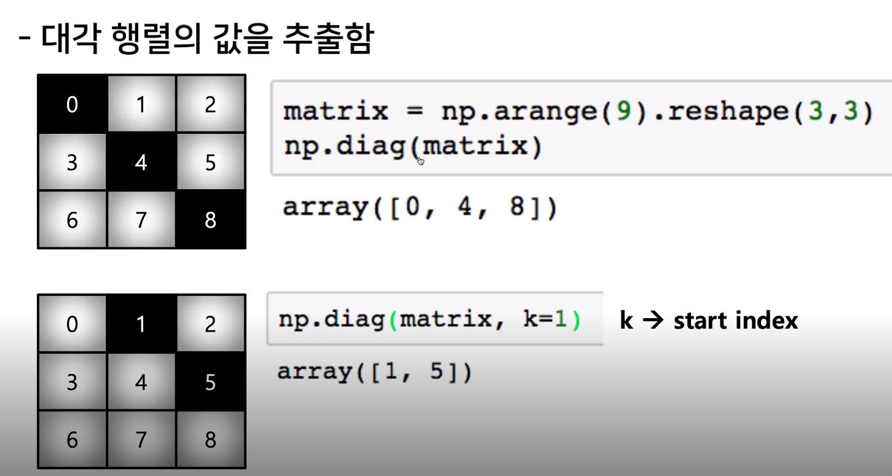

# Numpy

## Numpy 활용

### Numpy란?

- 일반적으로 과학계산에서 많이 사용하는 선형대수의 계산식을 파이썬으로 구현할 수 있도록 도와주는 라이브러리.
- 고성능 과학 계산용 패키지,**Num**erical **Py**thon의 줄인말
- Matrix와 Vector와 같은 Array 연산의 사실상의 표준
- 파이썬으로 진행되는 모든 데이터 분석과 인공지능 학습에 있어 가장 필수적으로 이해해야하는 도구, Python의 MATLAB

### Numpy의 장점

- 리스트로 행렬(Matrix)를 계산하면, 성능 저하와 굉징히 큰 Matrix 구현에 힘듦. 
- 그에 반해 Numpy는 일반 List 보다 빠르고, 메모리 효율적.(규모에 따라 다르지만 4배 정도 빠름)
  - 쥬피터 환경에서 %timeit 이라는 함수를 통하여 시간 측정 가능
- 반복문 없이 데이터 배열에 대한 처리 지원, 대용량 계산에 장점
- 선형 대수 관련 다양한 기능을 제공함
- 다른 언어와 통합 가능

### Numpy 실행

- windows 환경에선 conda로 가상환경을 설정해 주면 좋다.

```bash
conda create -n upstage python=3.8
conda activate upstage
conda install numpy jupyter # 또는 코랩에서 활용 가능
```

### Numpy 실습

#### nparray

- codes의 numpy 실습 jupyter notebook을 확인하면 더 좋다.
- 코드들은 jupyter notebook 기준이므로 )를 생략한 형태임.

> numpy 모듈의 호출

```python
import numpy as np # np: alias명, 불문율
```

> nparray

```python
a = [1, 2, 3, 4, '5']
a = np.array(a, int)  #dynamic typing not supported
# 하나의 데이터 type만 배열에 넣을 수 있음 (여기서는 Int), 리스트와의 차이점
type(a) # numpy.ndarray
type(a[2]) # numpy.int
a.dtype# dtype('int8')
```

- 주소값이 대신 들어가는 리스트와 달리 c언어처럼 배열처럼 같은 주소에 연이어 값이 들어가므로 성능상 빠르고 메모리 효율적인 대신 동적 형태 할당이 불가능하다.
- python is 를 이용하여 주소값을 비교해보면 리스트와 다르게 False가 나온다.

```python
a = [[1, 2, 3], [4, 5, 6], [4, 5, 6]]
np.array(a).shape # (3, 3), 
vector = [1, 2, 3, 4]
np.array(vector, int).shape # (4, )
matrix = [[1, 2, 5, 8], [1, 2, 5, 8], [1, 2, 5, 8]]
np.array(matrix, int) #shape는 (3,4) 4가 3 뒤로 밀렸다. 즉 커다란 층이 더 앞으로감(쌓임 예시 참조)
# array([[1, 2, 5, 8],
#       [1, 2, 5, 8],
#       [1, 2, 5, 8]])
np.array(matrix, int).ndim # 2, 차원 수 출력
np.array(tensor, int).size # 12, 항목 갯수 출력
```

- shape: 해당 행렬의 형태, 크기를 출력해준다.
- array의 Rank에 따라 불리는 이름이 다름

| Rank | Name     | Example                    |
| ---- | -------- | -------------------------- |
| 0    | scalar   | 7                          |
| 1    | vector   | [10,15]                    |
| 2    | matrix   | [[10,10], [15,15]]         |
| 3    | 3-tensor | [[[10,10,15], [15,15,10]]] |
| n    | n-tensor |                            |

- Array shape 쌓임 예시


```python
a = np.array([[1, 2, 3], [4.5, 5, 6]], dtype=np.int8)
a.dtype # dtype('int8')
np.array([[1, 2, 3], [4.5, "5", "6"]], dtype=np.float32).nbytes # 24
# 32bits = 4bytes 이므로 6 * 4bytes = 24bytes
```

- dtype에 따라 메모리 할당용량이 달라진다.
- 선언한 데이터값과 다른 값을 넣으면 자동 형변환 해줌

- bool, int8, int64, float 32, **float64**, complex 54, str, object, void 등의 여러 형태가 있다.

#### reshape

- Array의 element 갯수를 그대로 한 채로, shape의 크기를 변경하는 것을 의미

```python
[[1,2,5,6],[1,2,5,8]] => reshape => [1,2,5,6,1,2,5,8]
```

- numpy에서는 reshape 명령어를 통해 구현한다.

```python
test_matrix = [[1, 2, 3, 4], [1, 2, 5, 8]]
np.array(test_matrix).shape #(2, 4)

np.array(test_matrix).reshape(4, 2) 
# array([[1, 2],
#       [3, 4],
#       [1, 2],
#       [5, 8]])
np.array(test_matrix).reshape(2, 2, 2)
# array([[[1, 2],
#        [3, 4]],
#       [[1, 2],
#       [5, 8]]])
np.array(test_matrix).reshape(
    8,
) # array([1, 2, 3, 4, 1, 2, 5, 8])

np.array(test_matrix).reshape(2, -1) # -1: size를 기반으로 row 개수 선정
# array([[1, 2, 3, 4], [1, 2, 5, 8]])
```

- reshape의 함수의 리턴값 바뀐 새로운 배열이며, 원본은 할당하지 않는 이상 바뀌지 않는다.

> flatten

- 다차원 array를 1차원 array로 변환

```python
test_matrix = [[[1, 2, 3, 4], [1, 2, 5, 8]], [[1, 2, 3, 4], [1, 2, 5, 8]]]
np.array(test_matrix).flatten().size #16
np.array(test_matrix).flatten().shape #(16,)
```

#### indexing & slicing

```python
test_exmaple = np.array([[1, 2, 3], [4.5, 5, 6]], int)
test_exmaple # array([[1, 2, 3], [4, 5, 6]])
test_exmaple[0][2] # 3 이것도 가능하긴 하다.
test_exmaple[0, 2] # 3
```

- 리스트 인덱싱과 비슷하나, 이차원 배열 시 [0, 0] 형식으로 표기함

- test_example[0, 2] = 5 같이 할당또한 가능하다.

> slicing for numpy array

```python
a = np.array([[1,2,3,4,5], [6,7,8,9,10]], int)
a[:,2:] # array([[ 3,  4,  5], [ 8,  9, 10]])
a[1, 1:3] # array([7, 8])
a[1:3] # array([[ 6,  7,  8,  9, 10]])
a[1] # array([6,7,8,9,10])
a[:,-1] #array([ 5, 10])
```

- 여러 차원에서 일부분만 슬라이싱 가능, 넘어가는 부분은 에러가 아닌 존재하는 부분까지만 슬라이싱 됨. 

- 여기서 -1은 알아서 할당이 아닌 마지막 값을 의미한다.


- Start, end, sequence를 지정해줄 수 있다.

#### creation functions

1. arange

- array의 범위를 지정하여, 값의 list를 생성하는 명령어

```python
np.arange(0, 10, 0.5) # array([0. , 0.5, 1. , 1.5, 2. , 2.5, 3. , 3.5, 4. , 4.5, 5. , 5.5, 6. , 6.5, 7. , 7.5, 8. , 8.5, 9. , 9.5])
```
- arange: List의 range와 같은 효과
- integer로 0부터 29까지 배열추출
- floating point도 표시가능함
- reshape 등의 다른 함수 적용 가능

2. ones, zeros & empty
> zeros, ones 함수


```python
np.zeros((2, 5))  # 2 by 5 - zero matrix 생성
# array([[0., 0., 0., 0., 0.], [0., 0., 0., 0., 0.]])
np.ones(shape=(10,), dtype=np.int8) # array([1, 1, 1, 1, 1, 1, 1, 1, 1, 1], dtype=int8)
np.empty(shape=(10,), dtype=np.int8) # array([0, 0, 0, 0, 0, 0, 0, 0, 0, 0], dtype=int8)
np.empty((10, 5)) #array([[3.31183839e-033, 6.98348270e-077, 2.62395837e+179, ... [1.80286339e-310, 6.01346953e-154, 1.48710114e-076, 8.52243828e-096, 1.39804329e-076]])
```
- 해당 하는 값으로 가득찬 array 생성
- **empty함수는 0으로 된  array를 생성해주는게 아니라 가비지 데이터가 들어있는 메모리를 지정해줌  **

> ~ _like 함수

```python
test_matrix = np.arange(100).reshape(5, -1)
np.zeros_like(test_matrix, dtype=np.float32)
# array([[0., 0., 0., 0., 0., 0., 0., 0., 0., 0., 0., 0., 0., 0., 0., 0., ... [0., 0., 0., 0., 0., 0., 0., 0., 0., 0., 0., 0., 0., 0., 0., 0., 0., 0., 0., 0.]], dtype=float32)
```

- 기존 ndarray의 shape 크기 만큼 1, 0 또는 empty array를 반환

3. eye, identity, digonal & random

> identity 함수

```python
np.identity(n=5, dtype=np.int8) 
# array([[1, 0, 0, 0, 0],
#       [0, 1, 0, 0, 0],
#       [0, 0, 1, 0, 0],
#       [0, 0, 0, 1, 0],
#       [0, 0, 0, 0, 1]], dtype=int8)
```

- 단위 행렬(i 행렬)을 생성함

> eye 함수

```python
np.eye(N=3, M=5, dtype=np.int8)
# array([[1, 0, 0, 0, 0],
#       [0, 1, 0, 0, 0],
#       [0, 0, 1, 0, 0]], dtype=int8)
```

- 대각선인 1인 행렬, k값의 시작 idnex의 변경 가능

> diag 함수



- 대각 행렬의 값을 추출, k는 시작 인덱스

> random 함수

```python
np.random.normal(0, 1, 10).reshape(2, 5) # 정규 분포
# array([[-0.14950323,  0.57639207,  1.07549923,  0.69918396,  0.4341872 ],
#      [ 1.45683959, -0.63192178,  1.75431129,  0.40488555, -1.77115048]])
np.random.uniform(0, 1, 10).reshape(2, 5) # 균등 분포
# array([[0.47681353, 0.19224974, 0.23173034, 0.04547419, 0.83278489],
#       [0.71680775, 0.54049213, 0.67707533, 0.3610137 , 0.41012909]])
```

- 데이터 분포에 따른 sampling으로 array 생성
- exponential 분포 등도 존재

#### operation functions

> sum, mean, std 함수

```python
test_array = np.arrange(1,11)
test_array.sum(dtype=np.float) # 55.0
test_array = np.arange(1, 13).reshape(3, 4)
test_array.sum(axis=1), test_array.sum(axis=0) # (array([10, 26, 42]), array([15, 18, 21, 24]))
test_array.std(), test_array.std(axis=0) #(3.452052529534663, array([3.26598632, 3.26598632, 3.26598632, 3.26598632]))
```

- ndarry의 element들 간의 합을 구함, list의 sum 기능과 동일
- mean : 평균, std: 표준 편차 환산
- axis(축)에 따라 연산 또한 가능함

##### axis란?

- 모든 operation function을 실행할 때 기준이 되는 dimension 축


- 이외에도 np.exp()(자연지수), np.sqrt()(루트)

> Concatenate 관련 함수들

```python
a = np.array([1, 2, 3])
b = np.array([2, 3, 4])
np.vstack((a, b)) # array([[1, 2, 3], [2, 3, 4]])
np.concatenate((a, b), axis=1) # array([[1, 2, 3, 2, 3, 4]])
a = np.array([[1], [2], [3]])
b = np.array([[2], [3], [4]])
np.hstack((a, b)) # array([[1, 2], [2, 3], [3, 4]])
```

- numpy array를 합치는(붙이는) 함수

> 축에 따른 붙이는 모습 도식화


> 축을 추가하여 붙이기

```python
a = np.array([[1, 2], [3, 4]])
b = np.array([5, 6])
b = b[np.newaxis, :] # b.reshape(-1, 2)를 하여도 됨 
np.concatenate((a, b.T), axis=1)
```

- np.newaxis로 축 늘리기

#### Array_operation

- shape가 같을 때, array간 같은 위치의 element 끼리 기본적인 사칙연산 지원 (+,-,*,%)
  - 이를 Element-wise operation 이라고 한다.

> Dot product

```python
test_a = np.arange(1, 7).reshape(2, 3)
test_b = np.arange(7, 13).reshape(3, 2)
test_a.dot(test_b)
# array([[ 58,  64],
#       [139, 154]]) 
```

- Matrix의 기본 연산, dot 함수 사용

> transpose 또는 T attribute 사용

```python
test_a
# array([[1, 2, 3],
#      [4, 5, 6]])
test_a.transpose()
test_a.T
# 둘다
# array([[1, 4],
#        [2, 5],
#        [3, 6]])
```

- 전치행렬을 생성한다. (행과 열이 바뀜)

> broadcasting


```python
test_matrix
# array([[1., 2., 3.],
#      [4., 5., 6.]])
test_matrix // 2  # Matrix - Scalar 몫
# array([[0., 1., 1.],
#       [2., 2., 3.]])
```
- shape 가 다른 배열 간 연산을 지원하는 기능


#### comparisions

> all & any 함수

```python
a = np.arange(10) # array([0, 1, 2, 3, 4, 5, 6, 7, 8, 9])
np.all(a > 5), np.all(a < 10) # (False, True)
np.any(a > 5), np.any(a < 0) # (True, False)
a < 4 # array([ True,  True,  True,  True, False, False, False, False, False, False])
```

- all : 모든 element가 만족하는가?
- any: 단 하나의 element라도 만족하는가?

> comparisioni operation

```python
test_a = np.array([1, 3, 0], float)
test_b = np.array([5, 2, 1], float)
test_a > test_b # array([False,  True, False])
test_a >= test_b # array([False,  True, False])
```

- 배열의 크기가 동일할 시, element wise operation 이 후 boolean type 반환

> comparisioni operation2

```python
test_a = np.array([1, 3, 0], float)
test_b = np.array([5, 2, 1], float)
np.logical_and(a > 0, a < 3)  # and 조건의 condition, array([False,  True,  True, False, False, False, False, False, False, False])
np.logical_or(b, c)  # OR 조건의 condition, array([ True,  True,  True])
b = np.array([True, False, True], bool)
np.logical_not(b) # array([False,  True, False]) 반대로 바꿔줌
```

> np.where

```python
np.where(a > 5, 3, 2)  # where(condition, TRUE?, FALSE?)
# array([2, 2, 2, 2, 2, 2, 3, 3, 3, 3])
np.where(a > 5) # (array([6, 7, 8, 9], dtype=int64),)
a = np.array([1, np.NaN, np.Inf], float)
np.isnan(a) # None 입니까?, array([False,  True, False])
np.isfinite(a) # 메모리를 넘어가는 큰 수입니까?, array([ True, False, False])
```

> argmax & argmin

```python
a = np.array([1, 2, 4, 5, 8, 78, 23, 3])
a.argsort()[::-1] # array([5, 6, 4, 3, 2, 7, 1, 0], dtype=int64),크기순 index 값을 뽑아준다.
np.argmax(a), np.argmin(a) # (5, 0)
a = np.array([[1, 2, 4, 7], [9, 88, 6, 45], [9, 76, 3, 4]])
np.argmax(a, axis=1), np.argmin(a, axis=0) #(array([3, 1, 1], dtype=int64), array([0, 0, 2, 2], dtype=int64))
```

- array 내 최대값 또는 최소값의 index를 반환함
- axis 기반의 반환

#### boolean & fancy index

> boolean index

```python
test_array = np.array([1, 4, 0, 2, 3, 8, 9, 7], float)
test_array > 3 # array([False,  True, False, False, False,  True,  True,  True])
test_array[test_array > 3] # array([4., 8., 9., 7.])
condition = test_array < 3 
test_array[condition] # array([1., 0., 2.])
(test_array > 3).astype(np.int) # array([0, 1, 0, 0, 0, 1, 1, 1])
```

- 특정 조건에 따른 값을 배열 형태로 추출
- Comparison operation 함수들도 모두 사용가능
- boolean return 값을 astype()을 통해 형변환할 수 있다.

> fancy index

```python
a = np.array([2, 4, 6, 8], float)
cond = np.array([0, 0, 1, 3, 2, 1], int)
a[cond] # array([2., 2., 4., 8., 6., 4.]) cond의 element를 index로 추출
a.take(b) # 같은 결과
```

- numpy는 array를 index value로 사용해서 값 추출

> fancy index with matrix form

```python
a = np.array([[1, 4], [9, 16]], float)
b = np.array([0, 0, 1, 1, 0], int)
c = np.array([0, 1, 1, 1, 1], int)
a[b, c]  # b를 row index, c를 column index로 변환하여 표시함
# array([ 1.,  4., 16., 16.,  4.])
```

#### numpy data io

> load txt & save csv

```python
a = np.loadtxt("./populations.txt", delimiter="\t") # 불러오기
np.savetxt("int_data.csv", a, fmt="%.2e", delimiter=",") # 저장하기
```

- persistance : numpy array의 파일화

> numpy object -npy

```python
np.save("npy_test", arr=a) # npy 파일 저장
npy_array = np.load(file="npy_test.npy") # npy 파일 불러오기
npy_array[:3]
```

- pickle 형식을 저장된다.